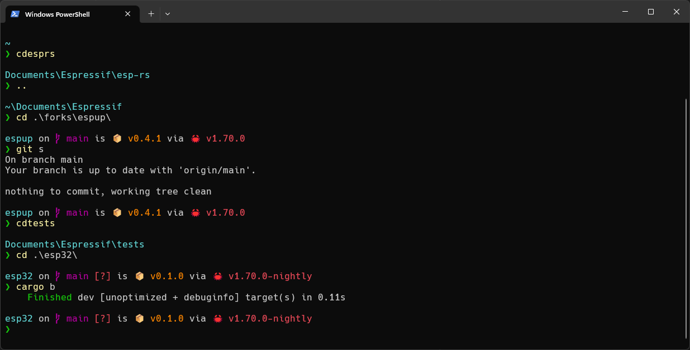

# Windows
Dotfiles for Windows environment.

- Terminal:
  - [Windows Terminal](https://apps.microsoft.com/store/detail/windows-terminal/9N0DX20HK701?hl=es-es&gl=es) as terminal
  - [Starship](https://starship.rs/) as prompt
  - Powershell as shell



- IDE:
  - [VS Code Insiders](https://code.visualstudio.com/insiders/) as IDE
  - Terminal is also using Starship and Powershell


## Winget
1. [Install Winget](https://learn.microsoft.com/en-us/windows/package-manager/winget/#install-winget)
    > **Note**
    > [Winget package registry browser](https://winget.run/)
2. Install packages:
   ```powershell
   Get-Content ".\packages" | ForEach-Object {  Write-Host "- Installing $_"; winget install --accept-package-agreements --accept-source-agreements $_ }
   ```

## Rust
1. [Install Rust](https://www.rust-lang.org/tools/install)
2. Install useful crates:
    ```powershell
    Get-Content -Path "..\common\rust\crates" | ForEach-Object { $crate, $arguments = $_.split(" ", 2); cargo install $crate $arguments }
    ```

## Starship
1. [Starship requires nerd font](https://starship.rs/guide/#%F0%9F%9A%80-installation), install them.

## Windows Terminal
> **Warning**
> Make sure that the `settings.json` path in `.mappings` is correct, see possible locations in https://learn.microsoft.com/en-us/windows/terminal/install#settings-json-file
> **Warning**
> Make sure that the required [nerd font](https://www.nerdfonts.com/) is installed, in this case, `Hack Nerd Font` is used

## [PowerToys](https://github.com/microsoft/PowerToys)
1. Disable `Win+Space` shortcut
    - Open PowerToys > Keyboard manager > Enable it > Remap a shortcut
      - Select: `Win (Left) + Space`
      - To send: `Disable`

## Nvidia GeForce
1. Disable Performance Overlay: Settings > General > Turn off In-game Overlay
